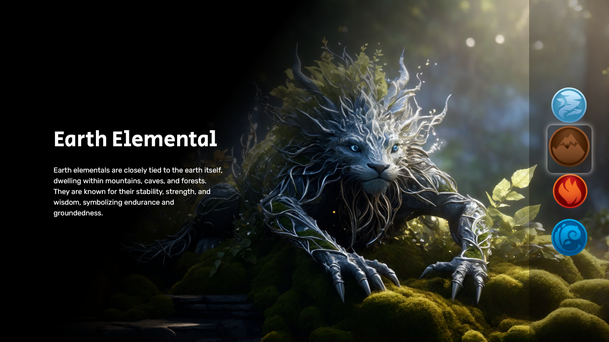

# Nature Elements - Semana do 0 ao Programador Contratado (DevEmDobro)

This project was developed in this week of guidance supported by Roberto Dias and Ricardo Dias. They are both Senior Full-stack developers. In this immersion we learned how to get the first job in the IT area, understanding the areas with most vacancies and how we can get the necessary qualification to apply for these opportunities in the future. They also developed a project using HTML, CSS and Javascript with us.  

## Table of contents

- [Overview](#overview)  
  - [The project](#the-project) 
  - [Screenshot](#screenshot)  
  - [Links](#links) 
- [My process](#my-process) 
  - [Built with](#built-with) 
- [Author](#author)

## Overview

### The project

- The project is based on the Nature Elementals (Air, Earth, Fire and Water). The website contains a main section with an image and a description of the elemental. The user can change the image and the description by choosing among four options in a sidebar menu on the right side. This sidebar menu contains the logos representing the four elements of the nature. 

### Screenshot

### Links

- Solution URL: [Website](https://paulo-xavier.github.io/nature-elementals-SEMANADO0AOPGMCONTRATADO/)
- Live Site URL: [GitHub repository](https://github.com/paulo-xavier/nature-elementals-SEMANADO0AOPGMCONTRATADO)

## My process

### Built with

- Semantic HTML5 markup
- CSS custom properties
- Flexbox
- Javascript

## Author
- Frontend Mentor - [@paulo-xavier](https://www.frontendmentor.io/profile/paulo-xavier)
- Instagram - [@oxavierpaulo](https://www.instagram.com/oxavierpaulo/)
- GitHub - [@paulo-xavier] (https://github.com/paulo-xavier)
- Linkedin - [@Paulo Roberto Xavier da Silva] (https://www.linkedin.com/in/paulo-xavier-15bb6924a/)

